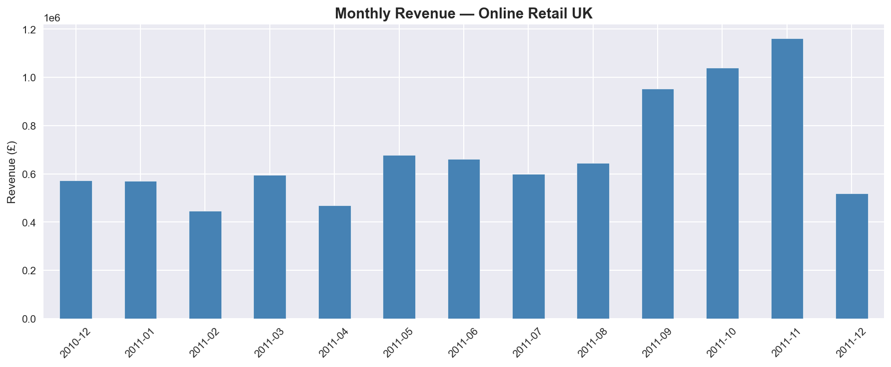
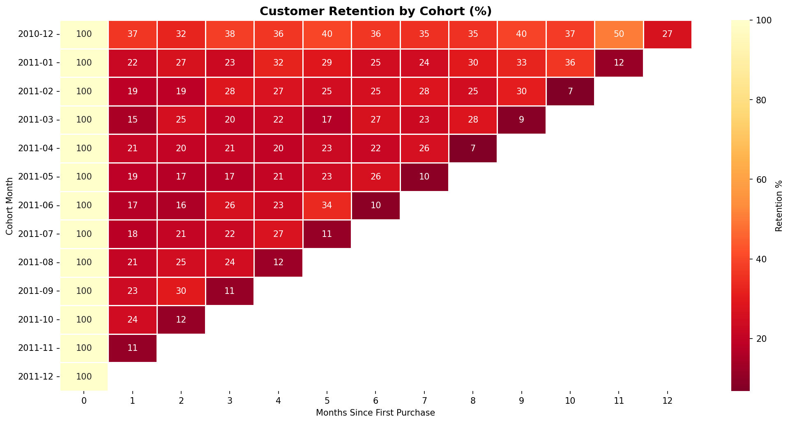
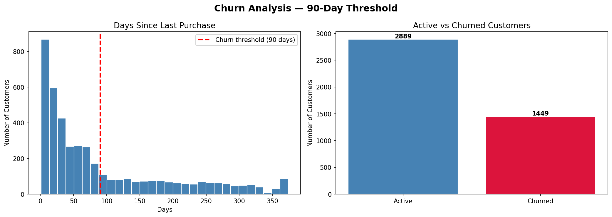
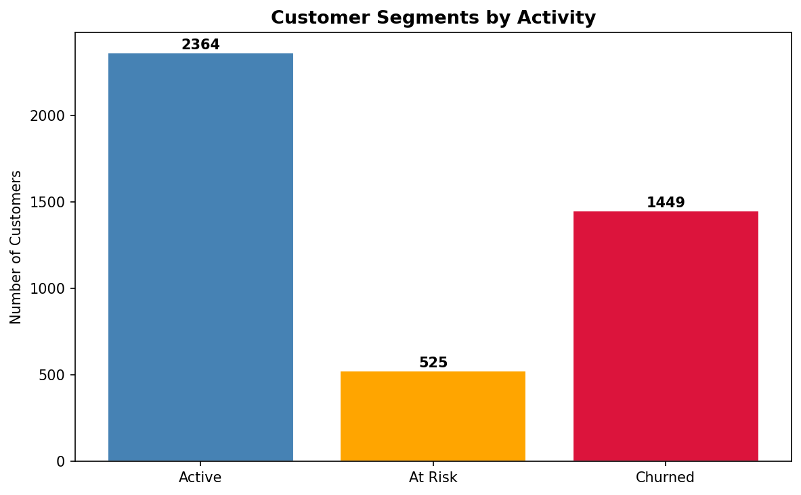
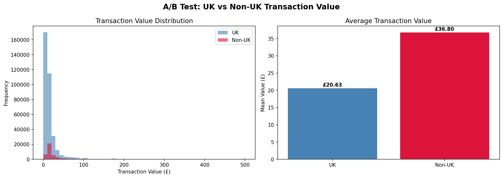
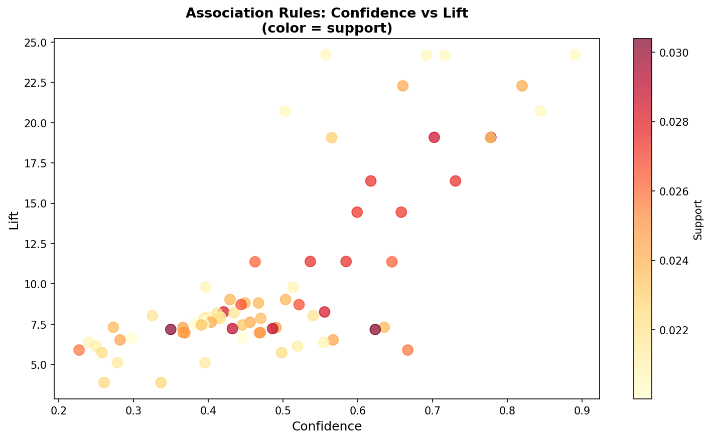

# Retail Customer Behavior Analysis — Online Retail UK

A full retail analytics project covering the key metrics and techniques 
used in real ecommerce and retail environments.

**Dataset:** [UCI Online Retail](https://archive.ics.uci.edu/dataset/352/online+retail) 
— 541,909 transactions from a UK-based gift shop between Dec 2010 and Dec 2011.

| # | Notebook | Topics |
|---|---|---|
| 01 | [EDA Overview](notebooks/01_eda_overview.ipynb) | Revenue, AOV, LTV, top products, seasonality |
| 02 | [Cohort Analysis](notebooks/02_cohort_analysis.ipynb) | Customer retention by cohort |
| 03 | [Churn Analysis](notebooks/03_churn_analysis.ipynb) | Churn rate, at-risk customers |
| 04 | [A/B Testing](notebooks/04_ab_testing.ipynb) | Statistical significance, conversion comparison |
| 05 | [Market Basket Analysis](notebooks/05_market_basket_analysis.ipynb) | Product associations, cross-sell |

## Key Findings

**EDA & Revenue**
- £8.9M total revenue across 4,338 unique customers over 12 months
- Strong Q4 seasonality — November peak at £1.16M

**Cohort Analysis**
- Dec-2010 cohort shows the strongest retention (~35-40% monthly)
- All cohorts lose 60-80% of customers after month 1

**Churn Analysis**
- 33% of customers are churned (90+ days inactive)
- 525 customers are in the at-risk zone (60-90 days) — prime targets for re-engagement

**A/B Testing**
- Non-UK customers spend 78% more per transaction than UK (£36.80 vs £20.63)
- Difference is statistically significant (p < 0.0001)

**Market Basket Analysis**
- The Regency Teacup collection (Green, Pink, Roses) shows lift of 24x — customers buy the full set
- 76 association rules found with lift > 1.5, indicating multiple cross-sell opportunities

## Stack
Python · pandas · matplotlib · seaborn · scikit-learn · scipy · mlxtend

### Monthly Revenue

### Customer Retention by Cohort

### Churn Analysis

### Customer Segments by Activity

### A/B Test: UK vs Non-UK

### Market Basket — Association Rules

